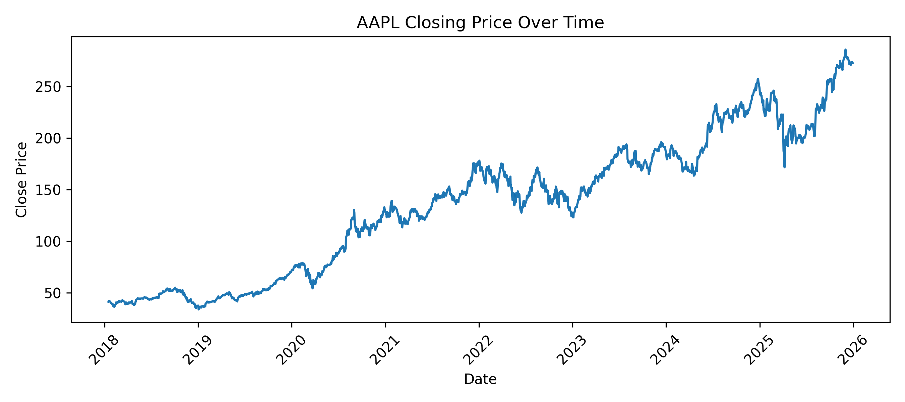
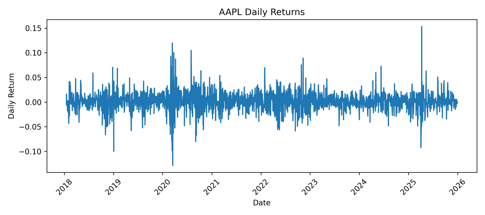
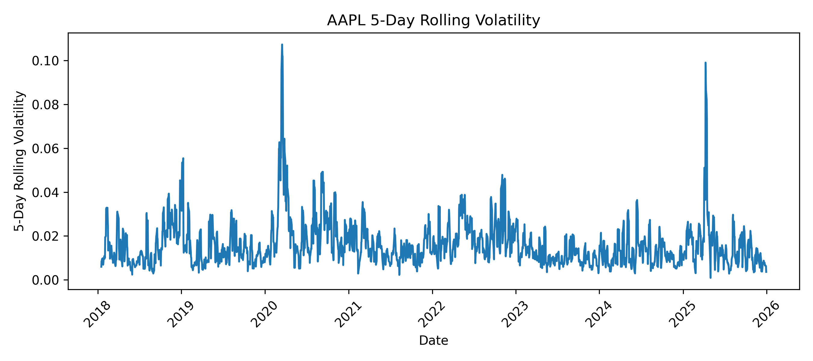

# Predicting Short-Term Stock Movement Using Price, Volume, and Cross-Asset Signals

## How to Build and Run the Code

This project is written in Python. The full pipeline can be reproduced using the included `Makefile`.

### 1. Clone the repository

```bash
git clone https://github.com/jihyeleekr/short-term-stock-prediction.git
cd short-term-stock-prediction
```

### 2. Create and activate a virtual environment

For macOS/Linux:

```bash
python -m venv venv
source venv/bin/activate
```

For Windows:

```bash
python -m venv venv
venv\Scripts\activate
```

### 3. Install dependencies

```bash
make install
```

This installs all required Python packages from `requirements.txt`.

### 4. Run the full project pipeline

```bash
make reproduce
```

This command runs preprocessing, stock visualizations, model training, model comparison, and interactive visualization generation.

### 5. Create interactive visualizations only

```bash
make interactive
```

This creates interactive Plotly HTML visualizations in:

```text
outputs/figures/interactive/
```

These files can be opened in a web browser and allow hovering, zooming, panning, and interactive comparison.

### 6. Run tests

```bash
make test
```

The tests check important parts of the project, including time-based splitting, target creation, and model fitting.

---

## Project Overview

The goal of this project is to predict short-term stock movement using historical stock price and volume data.

The main prediction task is binary classification:

```text
1 = the stock price goes up on the next trading day
0 = the stock price does not go up on the next trading day
```

The main target stocks are large technology-related companies:

```text
AAPL, MSFT, GOOGL, AMZN, META
```

The project compares a baseline model against cross-asset models. The baseline model only uses features from the target stock itself. The cross-asset models use related technology stocks as helper signals.

The main research question is:

> Can related technology stocks help improve next-day stock movement prediction compared to using only the target stock’s own historical data?

---

## Repository Structure

```text
.
├── data/
│   ├── raw/
│   └── processed/
│       ├── cross_asset_dataset.csv
│       └── model_dataset.csv
│
├── outputs/
│   ├── figures/
│   │   ├── AAPL/
│   │   │   ├── AAPL_price.png
│   │   │   ├── AAPL_returns.png
│   │   │   └── AAPL_volatility.png
│   │   ├── MSFT/
│   │   │   ├── MSFT_price.png
│   │   │   ├── MSFT_returns.png
│   │   │   └── MSFT_volatility.png
│   │   ├── GOOGL/
│   │   │   ├── GOOGL_price.png
│   │   │   ├── GOOGL_returns.png
│   │   │   └── GOOGL_volatility.png
│   │   ├── AMZN/
│   │   │   ├── AMZN_price.png
│   │   │   ├── AMZN_returns.png
│   │   │   └── AMZN_volatility.png
│   │   ├── META/
│   │   │   ├── META_price.png
│   │   │   ├── META_returns.png
│   │   │   └── META_volatility.png
│   │   ├── baseline_logistic/
│   │   ├── cross_asset_logistic/
│   │   ├── random_forest/
│   │   ├── gradient_boosting/
│   │   ├── model_comparison/
│   │   └── interactive/
│   │       ├── interactive_stock_prices.html
│   │       ├── interactive_daily_returns.html
│   │       ├── interactive_volatility.html
│   │       ├── interactive_correlation_matrix.html
│   │       └── interactive_model_comparison.html
│   │
│   └── metrics/
│       ├── baseline_logistic_metrics.json
│       ├── cross_asset_metrics.json
│       ├── cross_asset_rf_metrics.json
│       ├── cross_asset_gradient_boosting_metrics.json
│       ├── model_comparison.csv
│       └── train_val_test_comparison.csv
│
├── src/
│   ├── analyze_correlation.py
│   ├── build_cross_features.py
│   ├── compare_models.py
│   ├── config.py
│   ├── data_collection.py
│   ├── plot_confusion_comparison.py
│   ├── plot_interactive_visualizations.py
│   ├── plot_stock_visualizations.py
│   ├── plot_train_val_test_comparison.py
│   ├── preprocessing.py
│   ├── train_classification.py
│   ├── train_cross_asset_gradient_boosting.py
│   ├── train_cross_asset_model.py
│   └── train_cross_asset_random_forest.py
│
├── tests/
│   └── test_core.py
│
├── .github/
│   └── workflows/
│       └── tests.yml
│
├── .gitignore
├── Makefile
├── requirements.txt
└── README.md
```

---

## Data

The project uses historical daily stock data. The main fields include:

```text
date
ticker
open
high
low
close
volume
```

The project stores raw and processed data locally under the `data/` directory.

The main processed datasets are:

```text
data/processed/model_dataset.csv
data/processed/cross_asset_dataset.csv
```

The target stocks are:

```text
AAPL, MSFT, GOOGL, AMZN, META
```

The helper stocks used for cross-asset prediction include technology and semiconductor-related companies, such as:

```text
NVDA, AMD, INTC, AVGO, QCOM, TSM
```

---

## Data Processing

The preprocessing code creates model-ready datasets from historical stock data.

The main processing steps are:

1. Convert dates into datetime format.
2. Sort each stock by date.
3. Remove or handle missing values.
4. Calculate daily and multi-day returns.
5. Calculate moving averages.
6. Calculate rolling volatility.
7. Calculate volume change.
8. Align target stocks and helper stocks by date.
9. Create the next-day direction target.

The baseline dataset uses each stock’s own historical features. The cross-asset dataset uses related stocks as helper features.

---

## Features

The baseline logistic regression model uses features such as:

```text
ret_1d
ret_3d
ret_5d
ma_5
ma_10
vol_5d
volume_change_1d
spy_ret_1d
spy_ret_5d
```

The cross-asset models use helper stock returns. For example:

```text
AAPL uses MSFT, GOOGL, NVDA
MSFT uses AAPL, GOOGL, NVDA
GOOGL uses MSFT, AAPL, AMZN
AMZN uses MSFT, AAPL, GOOGL
META uses GOOGL, MSFT, AAPL
```

The target variable is:

```text
target_direction
```

where:

```text
1 = next-day close price is higher than current close price
0 = next-day close price is not higher than current close price
```

---

## Train / Validation / Test Split

This project uses a time-based split instead of a random split.

```text
Training set: earliest 70%
Validation set: next 15%
Test set: final 15%
```

This is important because stock data is time-dependent. Random splitting could accidentally allow future information to influence the training set.

The time-based split makes the experiment more realistic because the models train on past data and are evaluated on later unseen data.

---

## Models

This project compares four main models.

### 1. Baseline Logistic Regression

File:

```text
src/train_classification.py
```

This model uses only the target stock’s own features. It is the main baseline model.

### 2. Cross-Asset Logistic Regression

File:

```text
src/train_cross_asset_model.py
```

This model uses helper stocks as additional predictive signals. It also tests different regularization strengths using different `C` values.

The best model is selected using validation ROC-AUC.

### 3. Cross-Asset Random Forest

File:

```text
src/train_cross_asset_random_forest.py
```

This model uses a Random Forest classifier with cross-asset helper features. It can capture nonlinear relationships between related stocks.

The script tries multiple parameter settings internally and selects the best model using validation ROC-AUC.

### 4. Cross-Asset Gradient Boosting

File:

```text
src/train_cross_asset_gradient_boosting.py
```

This model uses Gradient Boosting with cross-asset helper features. It uses shallow trees and small learning rates to reduce overfitting.

The script tries multiple parameter settings internally and selects the best model using validation ROC-AUC.

---

## Evaluation Metrics

The models are evaluated using:

```text
Accuracy
F1 Score
ROC-AUC
```

### Accuracy

Accuracy measures the percentage of correct predictions.

However, accuracy can be misleading if the model predicts one class much more often than the other.

### F1 Score

F1 score balances precision and recall. It is useful because the model should predict both up and down movements, not only the majority class.

### ROC-AUC

ROC-AUC measures how well the model separates up days from down days. This is one of the most important metrics in this project because it evaluates the ranking quality of the model’s predicted probabilities.

---

## Visualizations

The project creates both static PNG visualizations and interactive Plotly HTML visualizations. The static plots are useful for quickly viewing results directly in the README, while the interactive HTML plots allow users to explore the data more deeply by hovering, zooming, and filtering.

### Stock-Level Visualizations

Stock-level plots are created by:

```bash
python src/plot_stock_visualizations.py
```

These plots are saved in separate folders for each stock:

```text
outputs/figures/AAPL/
outputs/figures/MSFT/
outputs/figures/GOOGL/
outputs/figures/AMZN/
outputs/figures/META/
```

The stock-level visualizations show closing price, daily returns, and 5-day rolling volatility. These plots help show how each stock behaves before modeling.

#### Example: AAPL Closing Price



This plot shows the closing price trend for AAPL over time. It helps provide context for the prediction task because the model is trying to predict the next-day direction of price movement.

#### Example: AAPL Daily Returns



This plot shows AAPL’s daily return values. Daily returns are more useful for modeling than raw prices because they show relative day-to-day movement and make stocks with different price levels easier to compare.

#### Example: AAPL 5-Day Rolling Volatility



This plot shows short-term volatility using a 5-day rolling window. Volatility is included because periods of high movement may affect how difficult next-day direction prediction becomes.

---

### Model-Specific Visualizations

Each model saves its own plots in a separate folder:

```text
outputs/figures/baseline_logistic/
outputs/figures/cross_asset_logistic/
outputs/figures/random_forest/
outputs/figures/gradient_boosting/
```

These plots include train/validation/test metric comparisons, overall test results, combined confusion matrices, and feature importance plots for tree-based models.

#### Baseline Logistic Regression: Train vs Validation vs Test


The baseline logistic regression uses only the target stock’s own features. This plot shows that the baseline has weak generalization, especially in F1 score. The training F1 is higher than validation and test F1 for several stocks, which suggests that the model learns some training patterns but does not generalize well to later data.

#### Cross-Asset Logistic Regression: Train vs Validation vs Test


The cross-asset logistic regression uses helper stocks as predictive signals. Compared to the baseline, this model has stronger validation and test performance. It still shows some train-test gap, especially in ROC-AUC, so it is not completely free from overfitting. However, the gap is smaller and the test performance is stronger than the baseline.

#### Random Forest: Train vs Validation vs Test


The Random Forest model captures nonlinear relationships between helper stocks and the target stock. This plot shows some overfitting because the training scores are often higher than validation and test scores. However, the model still improves over the baseline in several metrics.

#### Gradient Boosting: Train vs Validation vs Test


Gradient Boosting also uses cross-asset helper features and can capture nonlinear patterns. The model shows mild overfitting, but the use of shallow trees and regularized parameters helps control the gap between training and test performance.

---

### Model Comparison Visualizations

Model comparison plots are saved in:

```text
outputs/figures/model_comparison/
```

They compare all models using test accuracy, test F1 score, test ROC-AUC, and average test performance.

#### Overall Model Comparison


This plot compares the baseline model, cross-asset logistic regression, cross-asset Random Forest, and cross-asset Gradient Boosting across the five target stocks. The results show that cross-asset models generally outperform the baseline. This supports the main project hypothesis that related technology stocks provide useful predictive signals for next-day stock direction.

#### Average Test Performance by Model


This plot summarizes the average test performance across all target stocks. It is useful for comparing the overall behavior of each model rather than focusing on a single stock. The cross-asset models usually have stronger F1 and ROC-AUC than the baseline, showing that helper stock information improves the prediction task.

---

### Feature Importance Visualizations

Tree-based models provide feature importance values, which help explain which helper stocks contributed most to predictions.

#### Random Forest Feature Importance


This plot shows which helper stocks were most important for the Random Forest model for each target stock. This helps interpret whether related companies, such as other large technology or semiconductor stocks, were useful predictive signals.

#### Gradient Boosting Feature Importance


This plot shows the feature importance values for the Gradient Boosting model. Like Random Forest, it helps explain which cross-asset helper stocks contributed most to prediction.

---

### Interactive Visualizations

In addition to static PNG figures, this project includes interactive Plotly visualizations saved as HTML files.

These files are saved in:

```text
outputs/figures/interactive/
```

The interactive visualizations include:

```text
interactive_stock_prices.html
interactive_daily_returns.html
interactive_volatility.html
interactive_correlation_matrix.html
interactive_model_comparison.html
```

These HTML files can be opened in a web browser. They allow users to hover over data points, zoom into specific time periods, pan across charts, and compare stocks or models interactively.

To open an interactive visualization locally, run:

```bash
open outputs/figures/interactive/interactive_model_comparison.html
```

or double-click the `.html` file in the project folder.

The interactive plots make the results easier to explore than static figures alone. For example, the interactive model comparison chart allows users to compare model performance across target stocks, while the interactive correlation heatmap helps show relationships between stock returns.

---

## Testing and GitHub Workflow

The project includes test code in:

```text
tests/test_core.py
```

The tests use small synthetic datasets to verify core pipeline logic. The actual model training and reported results use the processed stock datasets in `data/processed/`.

The tests check:

1. The time-based split preserves chronological order.
2. The cross-asset target creation works correctly.
3. The baseline logistic regression model can fit and predict.

The tests can be run with:

```bash
make test
```

The GitHub Actions workflow is located at:

```text
.github/workflows/tests.yml
```

This workflow runs the test suite automatically when code is pushed to GitHub.

---

## Results

The baseline logistic regression model provides a simple comparison point. It uses only the target stock’s own price and volume features. The baseline model often performs close to random, especially in ROC-AUC and F1 score.

The cross-asset models generally perform better than the baseline. This suggests that related technology stocks contain useful information for predicting next-day movement.

The main finding is:

> Cross-asset feature engineering improves prediction more reliably than simply making the model more complex.

Cross-asset logistic regression is especially useful because it improves performance while remaining relatively stable and interpretable. It still shows some train-test gap, so it is not perfectly generalizing, but it performs much better than the baseline.

Random Forest and Gradient Boosting can capture nonlinear patterns, but they also show more risk of overfitting. Their training performance is often higher than validation and test performance, which means they may learn patterns that do not generalize well to future data.

---

## Interpretation

The results suggest that related stocks can provide useful signals. For example, large technology companies and semiconductor companies often move together because they are affected by similar market conditions, investor expectations, and sector-level trends.

The correlation heatmap supports this idea by showing positive relationships among many technology-related stocks. This motivated the cross-asset approach.

The model comparison plots show that the cross-asset models usually outperform the baseline model. This supports the project hypothesis that helper stock information improves short-term stock movement prediction.

The train, validation, and test plots also show that overfitting is an important issue. The baseline model has weak generalization, especially in F1 score. Cross-asset logistic regression shows mild overfitting but is more stable than the baseline. Random Forest and Gradient Boosting sometimes achieve strong test performance but require careful tuning to control overfitting.

---

## Limitations

This project has several limitations:

1. Stock markets are noisy and difficult to predict.
2. The models only use historical price and volume data.
3. The models do not use news, earnings reports, macroeconomic indicators, or sentiment data.
4. The project predicts only next-day direction, not the size of the price movement.
5. The project does not include a full trading strategy or transaction cost analysis.
6. Results may change across different market periods.

---

## Future Work

Possible future improvements include:

1. Adding more technical indicators such as RSI, MACD, and Bollinger Bands.
2. Adding market indicators such as VIX.
3. Adding news or social media sentiment features.
4. Testing walk-forward validation.
5. Testing probability calibration.
6. Adding transaction costs and backtesting a trading strategy.
7. Comparing performance across different market regimes.

---

## Final Conclusion

This project built a reproducible machine learning pipeline for predicting short-term stock movement.

The pipeline includes:

```text
data preprocessing
feature engineering
static stock visualizations
interactive Plotly visualizations
baseline modeling
cross-asset modeling
model comparison
testing
GitHub workflow automation
```

The project achieved its goal of comparing baseline and cross-asset approaches. The results show that cross-asset information from related technology stocks can improve next-day direction prediction compared to using only the target stock’s own historical features.

The final takeaway is:

> Cross-asset signals are useful for short-term stock movement prediction, but model complexity must be controlled carefully to avoid overfitting.

---

## Reproducibility Checklist

To reproduce the project:

```bash
make install
make test
make reproduce
```

The `make reproduce` command creates both static PNG visualizations and interactive HTML visualizations.

Expected output folders:

```text
outputs/metrics/
outputs/figures/
outputs/figures/interactive/
```

Important output files include:

```text
outputs/metrics/baseline_logistic_metrics.json
outputs/metrics/cross_asset_metrics.json
outputs/metrics/cross_asset_rf_metrics.json
outputs/metrics/cross_asset_gradient_boosting_metrics.json
outputs/metrics/model_comparison.csv
outputs/metrics/train_val_test_comparison.csv
```

Important interactive visualization files include:

```text
outputs/figures/interactive/interactive_stock_prices.html
outputs/figures/interactive/interactive_daily_returns.html
outputs/figures/interactive/interactive_volatility.html
outputs/figures/interactive/interactive_correlation_matrix.html
outputs/figures/interactive/interactive_model_comparison.html
```
