# Predicting Short-Term Stock Movement Using Price, Volume, and Cross-Asset Signals

## Final Presentation Video

A short presentation video for this project is available on YouTube:

[](https://youtu.be/n5h1zQW1Cpg)

Video link: https://youtu.be/n5h1zQW1Cpg

## How to Build and Run the Code

This project is written in Python. The full pipeline can be reproduced using the included `Makefile`.

### 1. Clone the repository

```bash
git clone https://github.com/jihyeleekr/short-term-stock-prediction.git
cd short-term-stock-prediction
```

### 2. Create and activate a virtual environment

For macOS/Linux:

```bash
python -m venv venv
source venv/bin/activate
```

For Windows:

```bash
python -m venv venv
venv\Scripts\activate
```

### 3. Install dependencies

```bash
make install
```

This installs all required Python packages from `requirements.txt`.

### 4. Run the full project pipeline

```bash
make reproduce
```

This command runs preprocessing, stock visualizations, model training, model comparison, and interactive visualization generation.

### 5. Create interactive visualizations only

```bash
make interactive
```

This creates interactive Plotly HTML visualizations in:

```text
outputs/figures/interactive/
```

These files can be opened in a web browser and allow hovering, zooming, panning, and interactive comparison.

### 6. Run tests

```bash
make test
```

The tests check important parts of the project, including time-based splitting, target creation, and model fitting.

---

## Project Overview

The goal of this project is to predict short-term stock movement using historical stock price and volume data.

The main prediction task is binary classification:

```text
1 = the stock price goes up on the next trading day
0 = the stock price does not go up on the next trading day
```

The main target stocks are large technology-related companies:

```text
AAPL, MSFT, GOOGL, AMZN, META
```

The project compares a baseline model against cross-asset models. The baseline model only uses features from the target stock itself. The cross-asset models use related technology stocks as helper signals.

The main research question is:

> Can related technology stocks help improve next-day stock movement prediction compared to using only the target stock’s own historical data?

---

## Repository Structure

```text
.
├── data/
│   ├── raw/
│   └── processed/
│       ├── cross_asset_dataset.csv
│       └── model_dataset.csv
│
├── outputs/
│   ├── figures/
│   │   ├── AAPL/
│   │   │   ├── AAPL_price.png
│   │   │   ├── AAPL_returns.png
│   │   │   └── AAPL_volatility.png
│   │   ├── MSFT/
│   │   │   ├── MSFT_price.png
│   │   │   ├── MSFT_returns.png
│   │   │   └── MSFT_volatility.png
│   │   ├── GOOGL/
│   │   │   ├── GOOGL_price.png
│   │   │   ├── GOOGL_returns.png
│   │   │   └── GOOGL_volatility.png
│   │   ├── AMZN/
│   │   │   ├── AMZN_price.png
│   │   │   ├── AMZN_returns.png
│   │   │   └── AMZN_volatility.png
│   │   ├── META/
│   │   │   ├── META_price.png
│   │   │   ├── META_returns.png
│   │   │   └── META_volatility.png
│   │   ├── baseline_logistic/
│   │   ├── cross_asset_logistic/
│   │   ├── random_forest/
│   │   ├── gradient_boosting/
│   │   ├── model_comparison/
│   │   └── interactive/
│   │       ├── interactive_stock_prices.html
│   │       ├── interactive_daily_returns.html
│   │       ├── interactive_volatility.html
│   │       ├── interactive_correlation_matrix.html
│   │       └── interactive_model_comparison.html
│   │
│   └── metrics/
│       ├── baseline_logistic_metrics.json
│       ├── cross_asset_metrics.json
│       ├── cross_asset_rf_metrics.json
│       ├── cross_asset_gradient_boosting_metrics.json
│       ├── model_comparison.csv
│       └── train_val_test_comparison.csv
│
├── src/
│   ├── analyze_correlation.py
│   ├── build_cross_features.py
│   ├── compare_models.py
│   ├── config.py
│   ├── data_collection.py
│   ├── plot_confusion_comparison.py
│   ├── plot_interactive_visualizations.py
│   ├── plot_stock_visualizations.py
│   ├── plot_train_val_test_comparison.py
│   ├── preprocessing.py
│   ├── train_classification.py
│   ├── train_cross_asset_gradient_boosting.py
│   ├── train_cross_asset_model.py
│   └── train_cross_asset_random_forest.py
│
├── tests/
│   └── test_core.py
│
├── .github/
│   └── workflows/
│       └── tests.yml
│
├── .gitignore
├── Makefile
├── requirements.txt
└── README.md
```

---

## Data

The project uses historical daily stock data. The main fields include:

```text
date
ticker
open
high
low
close
volume
```

The project stores raw and processed data locally under the `data/` directory.

The main processed datasets are:

```text
data/processed/model_dataset.csv
data/processed/cross_asset_dataset.csv
```

The target stocks are:

```text
AAPL, MSFT, GOOGL, AMZN, META
```

The helper stocks used for cross-asset prediction include technology and semiconductor-related companies, such as:

```text
NVDA, AMD, INTC, AVGO, QCOM, TSM
```

---

## Data Processing

The preprocessing code creates model-ready datasets from historical stock data.

The main processing steps are:

1. Convert dates into datetime format.
2. Sort each stock by date.
3. Check for missing or inconsistent values.
4. Calculate daily and multi-day returns.
5. Calculate moving averages.
6. Calculate rolling volatility.
7. Calculate volume change.
8. Align target stocks and helper stocks by trading date.
9. Create the next-day direction target.

### Missing Value Handling

Some missing values are created during feature engineering. For example, return features, moving averages, and rolling volatility require previous days of data, so the first few rows for each stock may not have enough historical information.

To handle this, I removed rows with missing values after feature creation using pandas cleaning logic such as `dropna()`. This ensures that all rows used for model training have complete feature values.

For the cross-asset dataset, I aligned stocks by trading date and removed dates where required stock return values were missing. This was important because cross-asset models need the helper stock values and target stock values to refer to the same trading day.

The baseline dataset uses each stock’s own historical features. The cross-asset dataset uses related stocks as helper features.

---

## Features

The baseline logistic regression model uses engineered features from each target stock’s own historical price and volume data, plus SPY market-context features.

| Feature | Meaning |
|---|---|
| `ret_1d` | 1-day return: how much the stock changed compared to the previous trading day |
| `ret_3d` | 3-day return: short-term price movement over the last 3 trading days |
| `ret_5d` | 5-day return: short-term price movement over the last 5 trading days |
| `ma_5` | 5-day moving average of the closing price |
| `ma_10` | 10-day moving average of the closing price |
| `vol_5d` | 5-day rolling volatility, calculated from recent returns |
| `volume_change_1d` | 1-day percentage change in trading volume |
| `spy_ret_1d` | 1-day SPY return, used as a market-level signal |
| `spy_ret_5d` | 5-day SPY return, used as a broader market trend signal |

The return features measure recent price movement. The moving average features summarize short-term trend direction. The volatility feature measures how unstable recent returns are. The volume feature captures changes in trading activity. SPY return features are included to represent overall market movement, since individual stocks are often affected by broader market direction.

For the cross-asset models, I also use helper stock return values. In the cross-asset dataset, columns such as `AAPL`, `MSFT`, `GOOGL`, `NVDA`, `QCOM`, and `TSM` represent each stock’s daily return on that trading date. Positive values mean the stock increased from the previous trading day, while negative values mean it decreased.

These features are appropriate for the task because the target is next-day stock direction, so recent returns, trend, volatility, volume changes, market movement, and related stock movements may all provide useful predictive signals.
The cross-asset models use helper stock returns. For example:

```text
AAPL uses MSFT, GOOGL, NVDA
MSFT uses AAPL, GOOGL, NVDA
GOOGL uses MSFT, AAPL, AMZN
AMZN uses MSFT, AAPL, GOOGL
META uses GOOGL, MSFT, AAPL
```

The target variable is:

```text
target_direction
```

where:

```text
1 = next-day close price is higher than current close price
0 = next-day close price is not higher than current close price
```

---

## Train / Validation / Test Split

This project uses a time-based split instead of a random split.

```text
Training set: earliest 70%
Validation set: next 15%
Test set: final 15%
```

This is important because stock data is time-dependent. Random splitting could accidentally allow future information to influence the training set.

The time-based split makes the experiment more realistic because the models train on past data and are evaluated on later unseen data.

---

## Models

This project compares four main models.

### 1. Baseline Logistic Regression

File:

```text
src/train_classification.py
```

This model uses only the target stock’s own features. It is the main baseline model.

### 2. Cross-Asset Logistic Regression

File:

```text
src/train_cross_asset_model.py
```

This model uses helper stocks as additional predictive signals. It also tests different regularization strengths using different `C` values.

The best model is selected using validation ROC-AUC.

### 3. Cross-Asset Random Forest

File:

```text
src/train_cross_asset_random_forest.py
```

This model uses a Random Forest classifier with cross-asset helper features. It can capture nonlinear relationships between related stocks.

The script tries multiple parameter settings internally and selects the best model using validation ROC-AUC.

### 4. Cross-Asset Gradient Boosting

File:

```text
src/train_cross_asset_gradient_boosting.py
```

This model uses Gradient Boosting with cross-asset helper features. It uses shallow trees and small learning rates to reduce overfitting.

The script tries multiple parameter settings internally and selects the best model using validation ROC-AUC.

---

## Evaluation Metrics

The models are evaluated using:

```text
Accuracy
F1 Score
ROC-AUC
```

### Accuracy

Accuracy measures the percentage of correct predictions.

However, accuracy can be misleading if the model predicts one class much more often than the other.

### F1 Score

F1 score balances precision and recall. It is useful because the model should predict both up and down movements, not only the majority class.

### ROC-AUC

ROC-AUC measures how well the model separates up days from down days. This is one of the most important metrics in this project because it evaluates the ranking quality of the model’s predicted probabilities.

---

## Visualizations and Results

This project focuses on model-related visualizations that compare performance, show overfitting behavior, and support the final results. Static PNG plots are saved under `outputs/figures/`, and interactive Plotly HTML files are saved under `outputs/figures/interactive/`.

### Train / Validation / Test Comparison

These plots compare train, validation, and test performance for each model using Accuracy, F1 score, and ROC-AUC. They are used to check whether the models are overfitting or generalizing well to later unseen data.

#### Baseline Logistic Regression

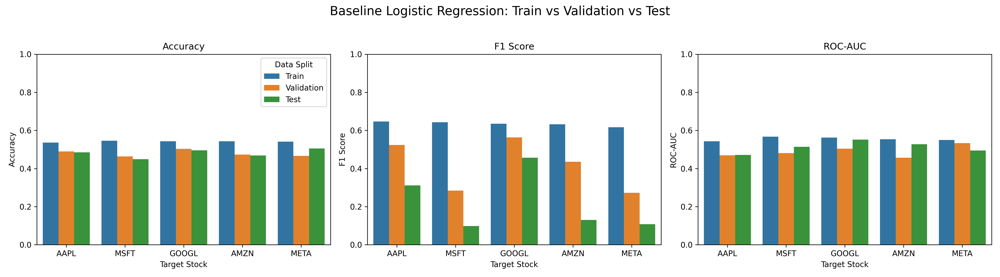

The baseline logistic regression uses only the target stock’s own historical features. The plot shows weak generalization, especially in F1 score. Several stocks have much higher training F1 than validation or test F1, which suggests overfitting and poor ability to predict both classes consistently. This supports the need for additional cross-asset features.

#### Cross-Asset Logistic Regression

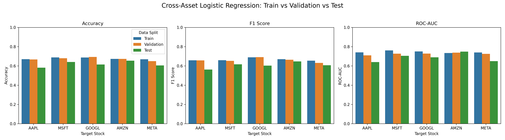

The cross-asset logistic regression model uses related stocks as helper signals. Compared to the baseline, it generally has stronger validation and test performance. It still shows some train-test gap, especially in ROC-AUC, but the gap is smaller than the baseline. This suggests that cross-asset features improve generalization.

#### Cross-Asset Random Forest

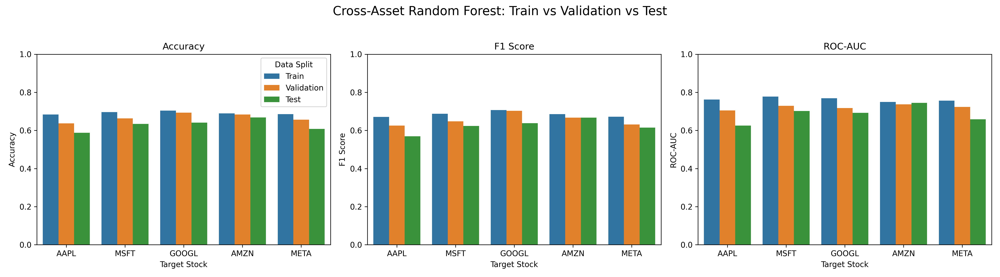

The Random Forest model captures nonlinear relationships between helper stocks and the target stock. The plot shows some overfitting because training scores are often higher than validation and test scores. However, it still improves over the baseline in several metrics, especially F1 and ROC-AUC.

#### Cross-Asset Gradient Boosting

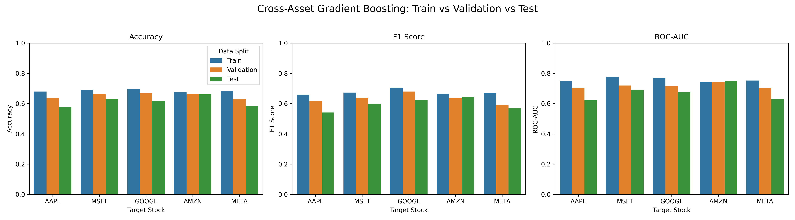

Gradient Boosting also uses cross-asset helper features and can capture nonlinear patterns. The model shows mild overfitting, but the use of shallow trees, smaller learning rates, and tuned parameters helps reduce the train-test gap.

---

### Overall Model Comparison

These plots compare all models on the test set. They directly support the project goal of determining whether cross-asset information improves prediction performance.

#### Test Metrics by Stock

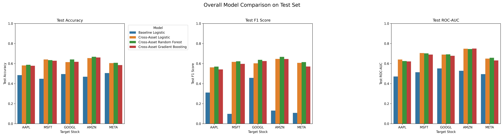

This plot compares the baseline model, cross-asset logistic regression, cross-asset Random Forest, and cross-asset Gradient Boosting across the five target stocks. The baseline logistic regression is generally the weakest model. The cross-asset models usually perform better, supporting the main project hypothesis that related technology stocks provide useful signals for next-day stock direction prediction.

#### Average Test Performance by Model

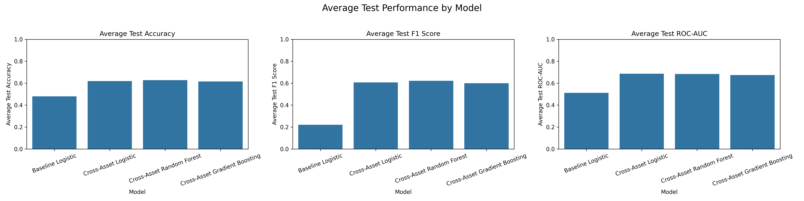

This plot summarizes average test performance across all target stocks. It gives a clearer overall comparison than looking at a single stock. The cross-asset models generally improve over the baseline, especially for F1 score and ROC-AUC.

---

### Confusion Matrix Results

Confusion matrices show how often each model predicts up or down correctly. These plots are useful because accuracy alone can hide whether a model is biased toward one class.

#### Baseline Logistic Regression Confusion Matrices

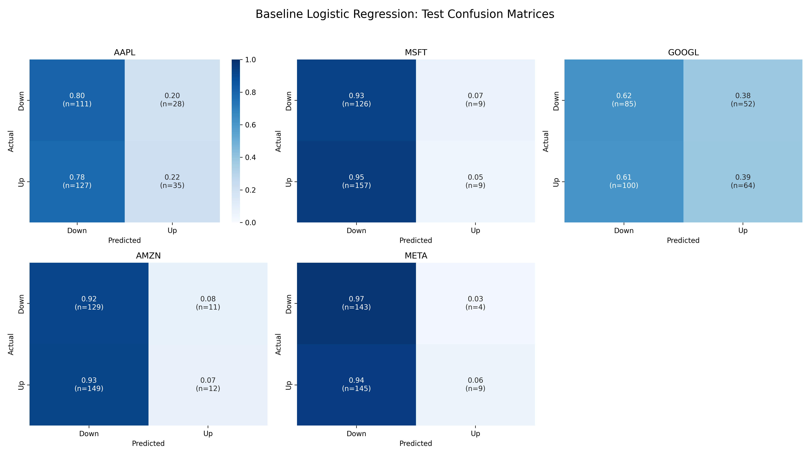

The baseline confusion matrices show that the baseline model often struggles to classify both directions consistently. This explains why the baseline F1 scores are weak for several stocks.

#### Cross-Asset Logistic Regression Confusion Matrices

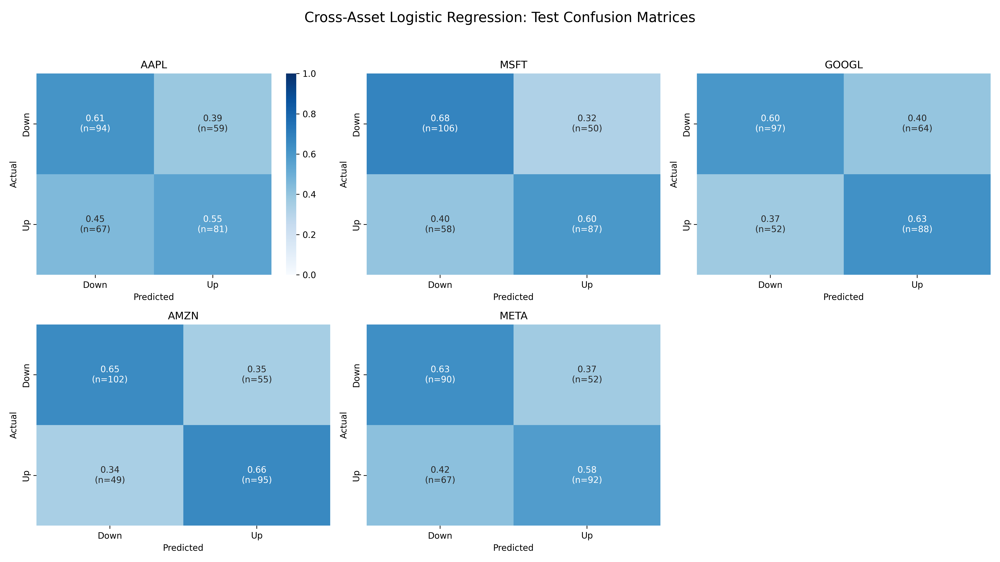

The cross-asset logistic model generally produces more balanced predictions than the baseline. This supports the idea that related stock movements add useful information beyond the target stock’s own features.

#### Random Forest Confusion Matrices

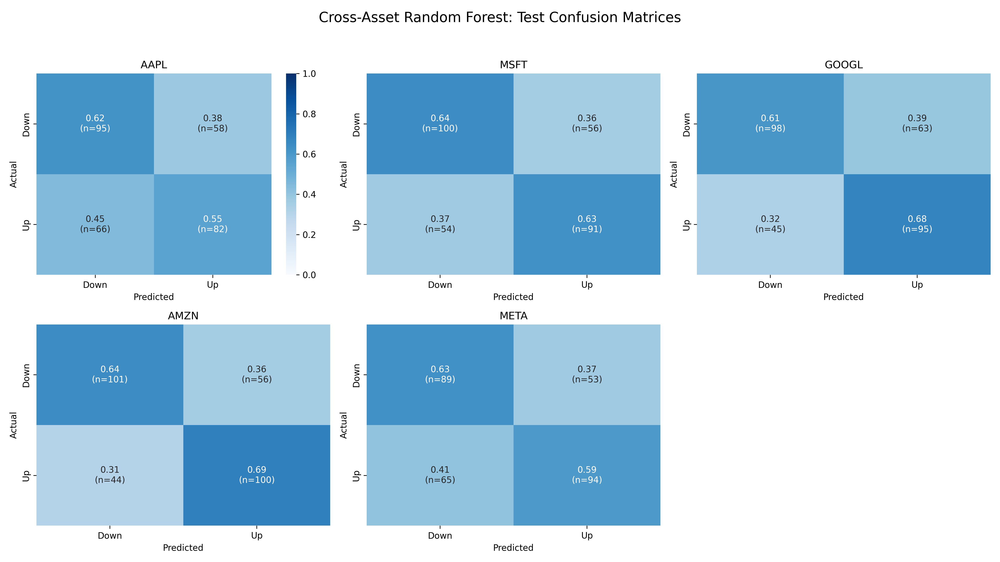

The Random Forest confusion matrices show how the nonlinear model performs across each target stock. This helps identify where the model improves and where it still confuses up and down days.

#### Gradient Boosting Confusion Matrices

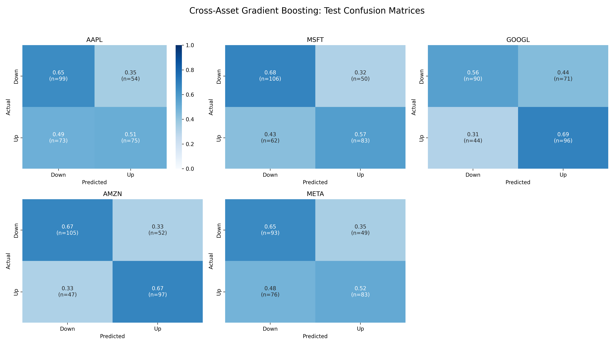

The Gradient Boosting confusion matrices show similar model behavior for the boosted tree model. These results help compare whether the model is improving both classes or mainly improving one class.

---

### Feature Importance

Tree-based models provide feature importance values, which help explain which helper stocks contributed most to predictions.

#### Random Forest Feature Importance

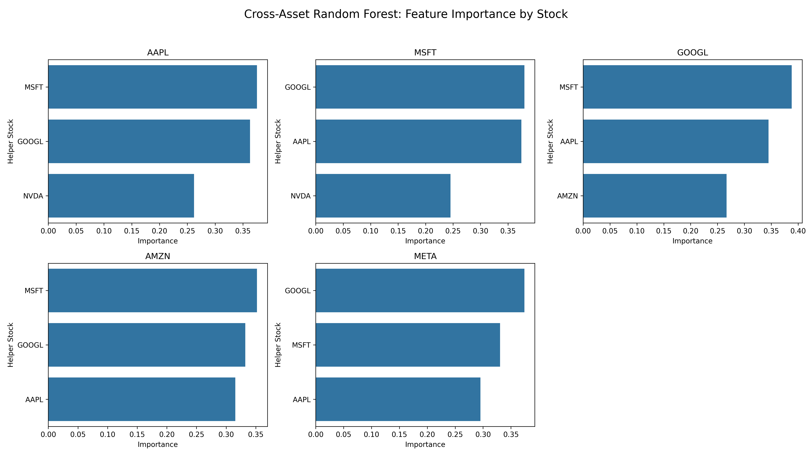

This plot shows which helper stocks contributed most to Random Forest predictions for each target stock. It helps interpret whether related technology or semiconductor stocks were useful predictive signals.

#### Gradient Boosting Feature Importance

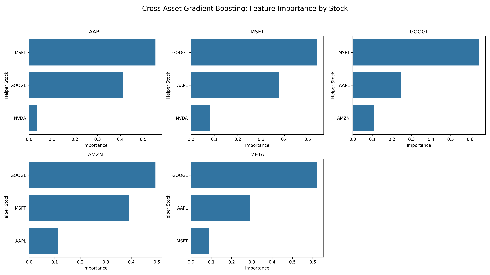

This plot shows which helper stocks contributed most to Gradient Boosting predictions. Comparing feature importance across tree-based models helps interpret the role of cross-asset features.

---

### Interactive Model Visualization

In addition to static PNG figures, this project includes interactive Plotly visualizations saved as HTML files.

The main model-related interactive visualization is:

```text
outputs/figures/interactive/interactive_model_comparison.html
```

This file can be opened in a web browser and allows users to hover, zoom, and compare model performance interactively.

To open it locally, run:

```bash
open outputs/figures/interactive/interactive_model_comparison.html
```

or double-click the `.html` file in the project folder.

---

## Testing and GitHub Workflow

The project includes test code in:

```text
tests/test_core.py
```

The tests use small synthetic datasets to verify core pipeline logic. The actual model training and reported results use the processed stock datasets in `data/processed/`.

The tests check:

1. The time-based split preserves chronological order.
2. The cross-asset target creation works correctly.
3. The baseline logistic regression model can fit and predict.

The tests can be run with:

```bash
make test
```

The GitHub Actions workflow is located at:

```text
.github/workflows/tests.yml
```

This workflow runs the test suite automatically when code is pushed to GitHub.

---

## Results

The baseline logistic regression model provides a simple comparison point. It uses only the target stock’s own price and volume features. The baseline model often performs close to random, especially in ROC-AUC and F1 score.

The cross-asset models generally perform better than the baseline. This suggests that related technology stocks contain useful information for predicting next-day movement.

The main finding is:

> Cross-asset feature engineering improves prediction more reliably than simply making the model more complex.

Cross-asset logistic regression is especially useful because it improves performance while remaining relatively stable and interpretable. It still shows some train-test gap, so it is not perfectly generalizing, but it performs much better than the baseline.

Random Forest and Gradient Boosting can capture nonlinear patterns, but they also show more risk of overfitting. Their training performance is often higher than validation and test performance, which means they may learn patterns that do not generalize well to future data.

---

## Interpretation

The results suggest that related stocks can provide useful signals. For example, large technology companies and semiconductor companies often move together because they are affected by similar market conditions, investor expectations, and sector-level trends.

The correlation heatmap supports this idea by showing positive relationships among many technology-related stocks. This motivated the cross-asset approach.

The model comparison plots show that the cross-asset models usually outperform the baseline model. This supports the project hypothesis that helper stock information improves short-term stock movement prediction.

The train, validation, and test plots also show that overfitting is an important issue. The baseline model has weak generalization, especially in F1 score. Cross-asset logistic regression shows mild overfitting but is more stable than the baseline. Random Forest and Gradient Boosting sometimes achieve strong test performance but require careful tuning to control overfitting.

---

## Limitations

This project has several limitations:

1. Stock markets are noisy and difficult to predict.
2. The models only use historical price and volume data.
3. The models do not use news, earnings reports, macroeconomic indicators, or sentiment data.
4. The project predicts only next-day direction, not the size of the price movement.
5. The project does not include a full trading strategy or transaction cost analysis.
6. Results may change across different market periods.

---

## Future Work

Possible future improvements include:

1. Adding more technical indicators such as RSI, MACD, and Bollinger Bands.
2. Adding market indicators such as VIX.
3. Adding news or social media sentiment features.
4. Testing walk-forward validation.
5. Testing probability calibration.
6. Adding transaction costs and backtesting a trading strategy.
7. Comparing performance across different market regimes.

---

## Final Conclusion

This project built a reproducible machine learning pipeline for predicting short-term stock movement.

The pipeline includes:

```text
data preprocessing
feature engineering
static stock visualizations
interactive Plotly visualizations
baseline modeling
cross-asset modeling
model comparison
testing
GitHub workflow automation
```

The project achieved its goal of comparing baseline and cross-asset approaches. The results show that cross-asset information from related technology stocks can improve next-day direction prediction compared to using only the target stock’s own historical features.

The final takeaway is:

> Cross-asset signals are useful for short-term stock movement prediction, but model complexity must be controlled carefully to avoid overfitting.

---

## Reproducibility Checklist

To reproduce the project:

```bash
make install
make test
make reproduce
```

The `make reproduce` command creates both static PNG visualizations and interactive HTML visualizations.

Expected output folders:

```text
outputs/metrics/
outputs/figures/
outputs/figures/interactive/
```

Important output files include:

```text
outputs/metrics/baseline_logistic_metrics.json
outputs/metrics/cross_asset_metrics.json
outputs/metrics/cross_asset_rf_metrics.json
outputs/metrics/cross_asset_gradient_boosting_metrics.json
outputs/metrics/model_comparison.csv
outputs/metrics/train_val_test_comparison.csv
```

Important interactive visualization files include:

```text
outputs/figures/interactive/interactive_stock_prices.html
outputs/figures/interactive/interactive_daily_returns.html
outputs/figures/interactive/interactive_volatility.html
outputs/figures/interactive/interactive_correlation_matrix.html
outputs/figures/interactive/interactive_model_comparison.html
```
